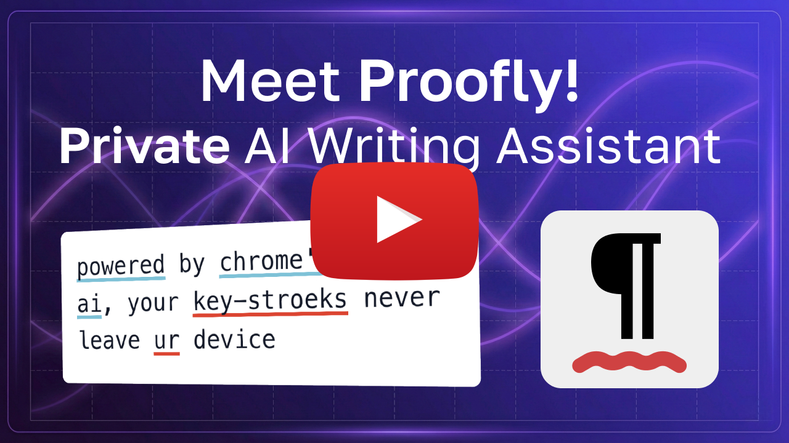

<div align="center">
  

# Proofly

### Private AI Writing, Proofreading & Grammar Assistant

[](https://opensource.org/licenses/MIT)
[](https://www.google.com/chrome/)
[](https://www.typescriptlang.org/)

**Your privacy-first writing assistant powered by Chrome on-device AI**

<a href="https://www.youtube.com/watch?v=XU2wM87VukY" target="_blank"></a>

[Features](#features) •
[Why Proofly](#why-proofly) •
[Installation](#installation) •
[Contributing](#development) •
[Privacy](#privacy--security)

</div>

---

## What is Proofly?

Proofly is a free, open-source Chrome extension that brings professional-grade writing assistance directly to your browser—**without compromising your privacy**. Unlike cloud-based alternatives like Grammarly, LanguageTool, or QuillBot, Proofly uses Chrome's Built-in AI APIs to proofread your writing entirely on-device. Your keystrokes never leave your machine.

### The Problems We Solve

Traditional writing assistants require sending your text to remote servers:

- ❌ Your private data travels across the internet
- ❌ Your writing is stored on company servers
- ❌ Requires constant internet connectivity
- ❌ Subject to data breaches and privacy violations
- ❌ Injects excessive UI to the sites you visit
- ❌ Expensive subscription fees

### Our Solution

Proofly runs 100% locally on your device:

- ✅ **Zero data transmission** - Everything stays on your machine
- ✅ **Complete privacy** - No servers, no logs, no tracking
- ✅ **Works offline** - No internet required after model download
- ✅ **Free forever** - Open source, no subscriptions
- ✅ **Lightweight** - Minimal script injection, zero dependencies
- ✅ **User friendly** - Introduces fresh, non-invasive UX patterns
- ✅ **Customizable** - Complete control on how you'd like to get assistance

---

## Features

### Privacy-First Architecture

- **On-Device Processing**: All AI proofreading happens locally using Chrome's Built-in AI models
- **Zero Server Communication**: Your text never leaves your browser
- **No Telemetry**: We don't collect any usage data or analytics
- **Open Source**: Complete transparency - audit the code yourself

### Intelligent Writing Assistance

- **Multilingual**: Supports all languages that the built-in Gemini Nano model provides
- **Spelling Corrections**: Catch typos and misspellings instantly
- **Grammar Fixes**: Subject-verb agreement, tense consistency, and more
- **Punctuation**: Proper comma usage, missing periods, quotation marks
- **Capitalization**: Sentence starts, proper nouns, title case
- **Preposition Usage**: Correct preposition selection
- **Missing Words**: Detect incomplete sentences

### User-Friendly Interface

- **Visual Highlights**: Color-coded underlines for different issue types
- **Inline Corrections**: Click any highlight to see suggestions
- **Keyboard Shortcuts**: Quick access with customizable hotkeys (Cmd/Ctrl+Shift+P)
- **Auto-Correct Mode**: Real-time checking as you type
- **Manual Mode**: Check on-demand whenever you want
- **Selection Correction**: Proofread your own highlighted text on-demand
- **Issues Sidebar**: View issues, navigate through them and apply suggested corrections in a dedicated panel
- **Undo/Redo Support**: Full history management for corrections

### Performance & Compatibility

- **Lightweight**: Minimal footprint (<5KB initial injection)
- **Fast**: Instant suggestions powered by local on-device AI
- **Shadow DOM Isolation**: No interference with host pages
- **Works Everywhere**: Input fields, textareas, contenteditable elements
- **Web Standards Compliant**: Ignores auto-correction on fields based on their semantics

### Customization

- **Configurable Correction Types**: Enable/disable specific issue types
- **Custom Colors**: Personalize highlight colors for each issue type
- **Underline Styles**: Choose solid, wavy, or dotted underlines
- **Keyboard Shortcuts**: Customize your workflow with auto-fix or manual-fix options
- **Autofix on Double-Click**: Quick correction with double-click

---

## Why Proofly?

| Feature                | Proofly           | Grammarly        | LanguageTool     | QuillBot         |
| ---------------------- | ----------------- | ---------------- | ---------------- | ---------------- |
| **Privacy**            | ✅ On-device only | ❌ Cloud-based   | ❌ Cloud-based   | ❌ Cloud-based   |
| **Works Offline**      | ✅ Yes            | ❌ No            | ❌ No            | ❌ No            |
| **Cost**               | ✅ Free forever   | 💰 $12-30/mo     | 💰 $5-20/mo      | 💰 $8-20/mo      |
| **Open Source**        | ✅ Yes            | ❌ No            | ⚠️ Partial       | ❌ No            |
| **No Data Collection** | ✅ Zero tracking  | ❌ Collects data | ❌ Collects data | ❌ Collects data |
| **Lightweight**        | ✅ <5KB initial   | ❌ Heavy scripts | ❌ Heavy scripts | ❌ Heavy scripts |
| **Browser Support**    | Chrome 141+       | All browsers     | All browsers     | All browsers     |

### Key Advantages

1. **Privacy You Can Verify**: Open-source code means no hidden data collection
2. **No Subscription Treadmill**: Free forever, no artificial limitations
3. **True Offline Mode**: Works on airplanes, remote locations, anywhere
4. **Lightning Fast**: No network latency, instant corrections
5. **Resource Efficient**: Minimal CPU and memory usage
6. **Non-Invasive**: Minimal native code is injected to the sites only when needed
7. **No Account Required**: No sign-up, no email, no personal info
8. **Future-Proof**: Uses Chrome's standard Built-in AI API and modern web tech

---

## Technology Stack

Proofly is built with modern web technologies and best practices:

### Core Technologies

- **[TypeScript](https://www.typescriptlang.org/)** - Strict type safety, comprehensive type coverage
- **[Web Components](https://www.webcomponents.org/introduction)** - Custom components - no framework bloat
- **[Chrome Built-in AI API](https://developer.chrome.com/docs/ai/built-in-apis)** - On-device proofreading and language detection models

### Architecture & Patterns

- **Web Components** - Standards-compliant custom elements with Shadow DOM
- **Vanilla JavaScript and CSS** - Zero framework dependencies for minimal bundle size
- **Functional Programming** - Pure functions, composition, immutability
- **Dependency Injection** - Testable, modular service architecture
- **Event-Driven Communication** - Loosely coupled components

### UI & Styling

- **Shadow DOM** - Complete style isolation, no CSS conflicts
- **CSS Custom Properties** - Design token system for theming
- **CSS Highlights API** - Native browser highlighting for performance
- **Popover API** - Native popup positioning and management

### Chrome Extension APIs

- **Chrome Storage API** - Sync settings across devices
- **Chrome Side Panel API** - Dedicated sidebar interface
- **Chrome Context Menus API** - Right-click integration
- **Content Scripts** - Page interaction and highlighting
- **Service Workers** - Background processing

### Build & Deployment

- **TypeScript Compiler** - Type checking and transpilation
- **Vite Plugin Ecosystem** - Build optimization and bundling
- **Chrome Web Store Packaging** - Automated release builds
- **Hot Module Replacement** - Instant dev feedback

---

## Requirements

### System Requirements

- **Operating System**: Windows 10/11, macOS 13+, Linux, or ChromeOS (Chromebook Plus)
- **Chrome Version**: Chrome 141+
- **Storage**: At least 22 GB free space (for AI model download)
- **GPU**: Recommended 4+ GB VRAM for optimal performance
- **Network**: Internet connection for initial model download (one-time)

### Browser Support

Proofly requires Chrome 141 or later with the Built-in AI Proofreader API enabled.

**Note**: The Proofreader API is in origin trial and will be available in stable Chrome soon.

---

## Installation

### For Users

#### Option 1: Chrome Web Store (Coming Soon)

1. Visit the Chrome Web Store listing
2. Click "Add to Chrome"
3. Follow the on-screen setup

#### Option 2: Manual Installation (Developers)

1. Download the latest release from GitHub
2. Extract the ZIP file
3. Open Chrome and navigate to `chrome://extensions/`
4. Enable "Developer mode" (toggle in top-right)
5. Click "Load unpacked"
6. Select the extracted `dist/` folder
7. Click on the Proofly icon and follow the setup wizard

### For Developers

```bash
# Clone the repository
git clone https://github.com/onderceylan/proofly.git
cd proofly

# Install dependencies
npm install

# Start development server with hot reload
npm run dev

# Build for production
# The extension will be built to dist/
npm run build

# Load dist/ as an unpacked extension in chrome://extensions/ for testing the prod build
# Load dev/ as an unpacked extension in chrome://extensions/ for testing the HMR dev build
```

---

## Development

### Prerequisites

- Node.js 18+ and npm
- Chrome Canary or Chrome Dev
- Git

### Development Workflow

```bash
# Install dependencies
npm install

# Start development server (auto-rebuilds on changes)
npm run dev

# Build the project
npm run build

# Type checking
npm run typecheck

# Linting
npm run lint

# Format checking and fixing
npm run format:check
npm run format

# Unit tests
npm run test
npm run test:watch

# Puppeteer tests
npm run test:e2e
npm run test:e2e:watch

# For setting up e2e test env, load extension in Chrome once for your test-focused puppeteer user profile
# 1. Download https://www.google.com/chrome/dev/
# 2. Run `npm run test:e2e:watch` to open the browser profile of puppeteer or launch the browser manually with `/Applications/Google\ Chrome\ Dev.app/Contents/MacOS/Google\ Chrome\ Dev \ --user-data-dir=$HOME/.cache/chrome-devtools-mcp/chrome-profile-canary --load-extension=./projects/proofly/dev --no-first-run --hide-crash-restore-bubble`
# 3. Open chrome://extensions/
# 4. Enable "Developer mode"
# 5. Click "Load unpacked"
# 6. Select the dev folder
# 7. Download the AI model once
```

### Development Guidelines

See [AGENTS.md](./AGENTS.md) for comprehensive development guidelines, including:

- Architecture principles
- Code style conventions
- Testing workflows
- Chrome extension patterns
- Logging guidelines

---

## Contributing

We welcome contributions from the community! Whether you're fixing bugs, adding features, or improving documentation, your help is appreciated.

### How to Contribute

1. **Pick an Issue**: Browse open issues or propose new features
2. **Fork & Branch**: Create a feature branch from `main`
3. **Make Changes**: Follow our coding standards and conventions
4. **Test Thoroughly**: Verify your changes work as expected through automated e2e tests
5. **Submit PR**: Open a pull request with a clear description

### Development Principles

- **Privacy First**: No data collection, no tracking, no telemetry
- **Minimal Footprint**: Keep bundle sizes small
- **Long-term Maintenance**: Avoid dependencies, and keep building on native web standards
- **Non-Invasive**: Respect the user's page and experience, keep injections minimal and isolated
- **Accessibility**: Support all users, including those with disabilities
- **Performance**: Optimize for speed and efficiency

---

## Privacy & Security

### Our Privacy Commitment

1. **Zero Data Collection**: We don't collect, store, or transmit any user data
2. **On-Device Processing**: All AI runs locally on your machine
3. **No Analytics**: No telemetry, no usage tracking, no crash reports
4. **No Accounts**: No sign-up, no user profiles, no personal information
5. **Open Source**: Fully auditable codebase for transparency

### Security Features

- **Minimal Permissions**: Only requests essential Chrome APIs
- **Content Security Policy**: Strict CSP prevents code injection
- **Shadow DOM Isolation**: UI components that are injected to the sites are completely isolated
- **No External Resources**: All assets bundled with extension
- **Regular Security Audits**: Community-driven code reviews

Read our full [Privacy Policy](./PRIVACY.md) for more details.

---

## License

This project is licensed under the **MIT License** - see the [LICENSE](./LICENSE) file for details.

---

## Acknowledgments

- **Chrome Team** - For developing the Built-in AI API and making on-device AI accessible
- **Open Source Community** - For the amazing tools and libraries that make this possible
- **Contributors** - Everyone who helps improve Proofly
- **Users** - For trusting us with your privacy and writing

---

## Links

- **Documentation**: [AGENTS.md](./AGENTS.md)
- **Privacy Policy**: [PRIVACY.md](./PRIVACY.md)
- **Chrome Built-in AI**: [developer.chrome.com/docs/ai/built-in-apis](https://developer.chrome.com/docs/ai/built-in-apis)
- **Issue Tracker**: [GitHub Issues](https://github.com/onderceylan/proofly/issues)
- **Discussions**: [GitHub Discussions](https://github.com/onderceylan/proofly/discussions)

---

## Support

- **Bug Reports**: [Open an issue](https://github.com/onderceylan/proofly/issues/new?template=bug_report.md)
- **Feature Requests**: [Request a feature](https://github.com/onderceylan/proofly/issues/new?template=feature_request.md)
- **Questions**: [Start a discussion](https://github.com/onderceylan/proofly/discussions)

---

If you find Proofly useful, please consider:

- ⭐ Starring the repo
- 🐛 Reporting bugs
- 💡 Suggesting features
- 🔀 Contributing code
- 📢 Spreading the word

**Privacy-first writing assistance is possible. Let's prove it together.**
